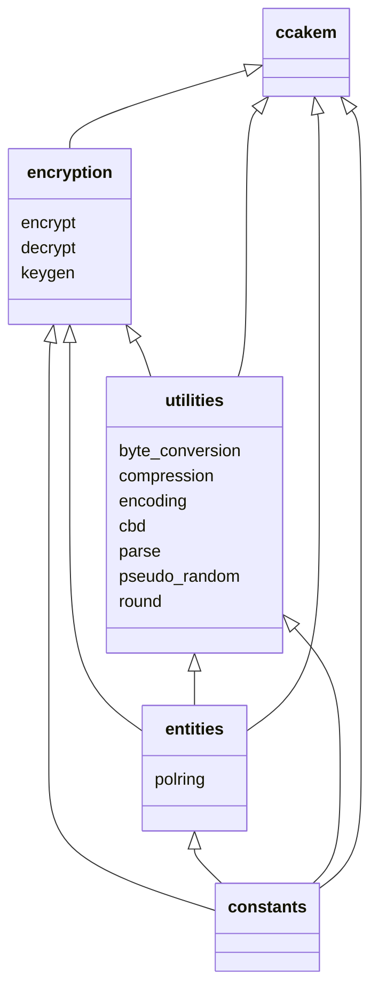

# Implementation

## Project structure

This project is divided into packages and modules that handle a small portion of the functionality. Packages have strict hierarchy that allows importing modules only from the same or lower-ranked package. Below is a diagram showing the import structure between packages.

Here are short descriptions of what is the purpose of each package:

* **utilities** package provides some basic functionalities, such as conversions, rounding and encoding, for higher-ranked modules to use.
* **entities** contains data structures.
* **constants** module has some fixed numerical values defined in the Kyber specification.
* **encryption** has capabilities for Kyber asymmetric encryption.
* **ccakem** has functions that utilize encryption and make Kyber a key-encapsulation mechanism.
