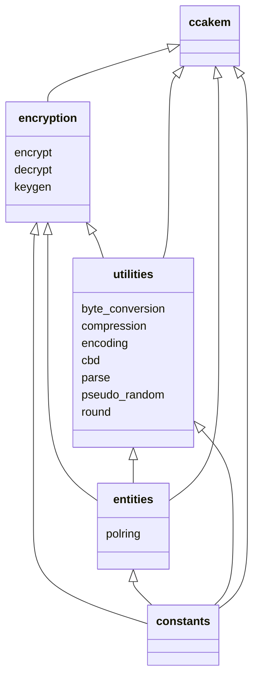

# Implementation

## Project structure

This project is divided into packages and modules that handle a small portion of the functionality. Packages have strict hierarchy that allows importing modules only from the same or lower-ranked package. Below is a diagram showing the import structure between packages.

Here are short descriptions of what is the purpose of each package:

* **utilities** package provides some basic functionalities, such as conversions, rounding and encoding, for higher-ranked modules to use.
* **entities** contains data structures.
* **constants** module has some fixed numerical values defined in the Kyber specification.
* **encryption** has capabilities for Kyber asymmetric encryption.
* **ccakem** has functions that utilize encryption and make Kyber a key-encapsulation mechanism.

## Utilities

Here are more in-depth descriptions of modules in utilities package.

### Byte conversion

Byte conversion module has some basic functions that integers and bit arrays to bytes, and vice versa.

### Compression

During the en/decryption the coefficients of polynomial ring are in modulo `q`, that is, between 0 and `q-1` (inclusive). When we transfer these polynomial rings, we can, however, reduce the size by downscaling these coefficients. That is done with compress and decompress functions.

### Encoding

Usually the polynomial rings are handled as `PolynomialRing` instances. We can not, however, send these instances over the Internet, so we have to encode them into byte arrays. At the other end, we need to recover polynomial ring from the byte array. This is done with encode and decode functions.

### Parse

Parse is a pseudo-random function that generates a specific type of polynomial ring instance from a random byte stream. This is different from decoding in that the input is byte stream instead of byte array, i.e., the number of bytes required to form the result is not known beforehand.

### CBD

This module provides a single function that deterministically produces a polynomial ring from byte array. Behavior of this function is quite similar to `parse` but in this case the length of the input byte array is fixed.

### Pseudo-random

This module includes multiple functions that use SHA-3 hash algorithm family to deterministically produce pseudo-random byte arrays from given seeds.

### Round

This small module provides a function that rounds floats in a "traditional" way, that is, ties rounded up instead of away from zero. For example, Python's built-in round function outputs `round(-3.5)=-4` whereas `normal_round(-3.5)=-3`.
