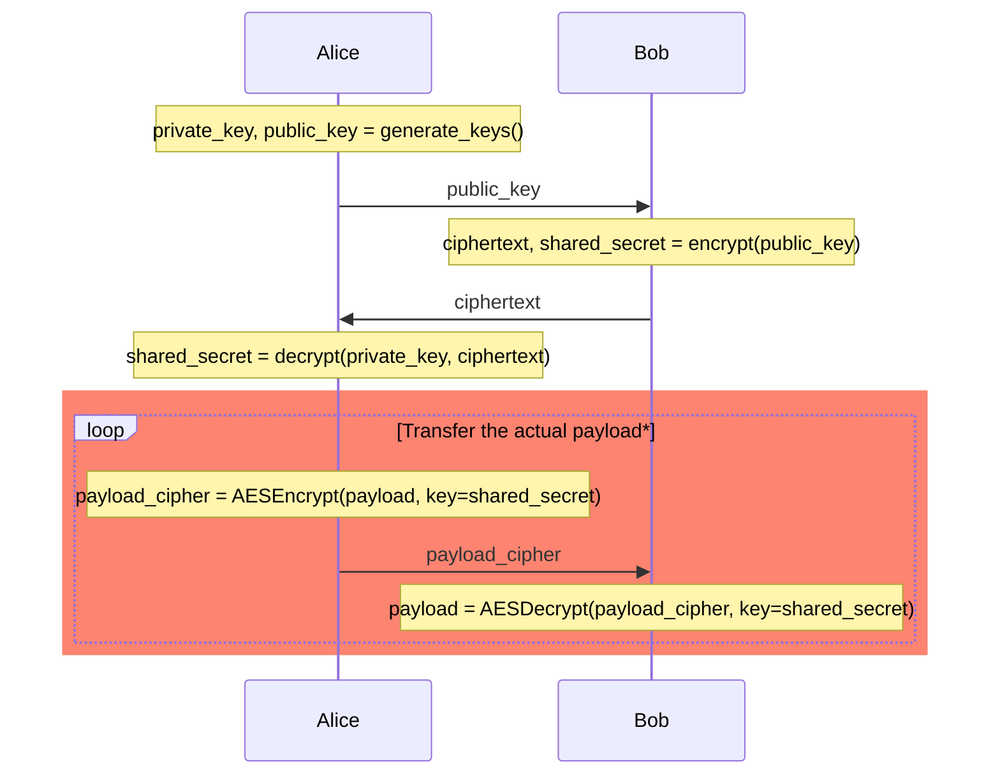

# Usage guide

## Installation

Make sure that you have [Poetry](https://python-poetry.org/) installed. After cloning the repository to your computer move to its root directory and run

```
poetry install
```

## Usage

Kyber has three main functions: key generation, encrypt and decrypt. Below is a diagram showing the workflow of key exchange.



*) Section called **transfer the actual payload** is out of Kyber's scope. It is here just to illustrate how the shared secret generated by Kyber can be used with symmetric encryption algorithm (such as AES) to securely transfer the payload. To see a working example of how `kyber` is used with AES, take a look at `perf_tests/test_aes_integration.py`.

#### In Python

`kyber` package can be used directly from Python code. A sample usage is included in  `main.py`.

#### CLI

Kyber can also be used via command-line interface that can be accessed with `poetry run python cli.py`. It has four subcommands: `keygen`, `pubkey`, `encrypt` and `decrypt`. Run any subcommand with `-h` flag to get help. Below is a usage example:

First, Alice generates a private key and extracts its public key to a separate file.

```
poetry run python cli.py keygen private.txt
poetry run python cli.py pubkey --output public.txt private.txt
```

After Bob has received Alice's public key, Bob can generate a random shared secret and encrypt it to ciphertext.

```
poetry run python cli.py encrypt --key alice_public.txt --secret secret.txt --cipher cipher.txt
```

When Alice receives Bob's ciphertext, Alice can decrypt it to obtain the same shared secret as Bob has.

```
poetry run python cli.py decrypt --key private.txt --output secret.txt bob_cipher.txt
```

### Tests

Unit tests can be run with

```
poetry run invoke test
```

### Coverage

Coverage report can be created with

```
poetry run invoke coverage-report
```

after which the report will appear at `htmlcov/index.html`.

### Performance tests

Run performance tests with

```
poetry run invoke performance
```

### Lint

Run static style cheking with

```
poetry run invoke lint
```
